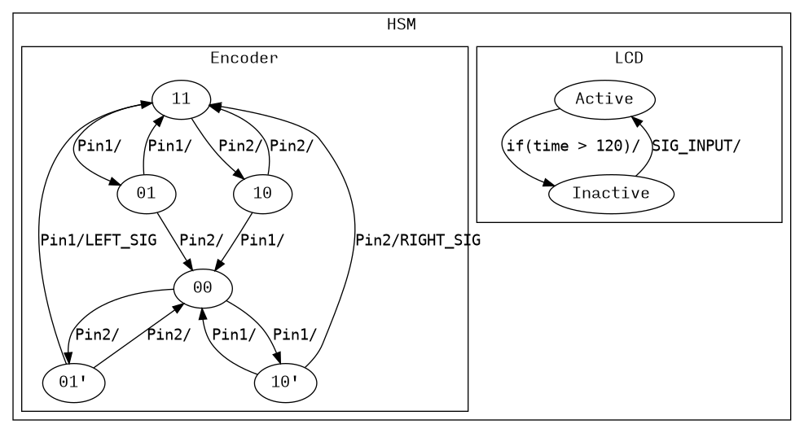
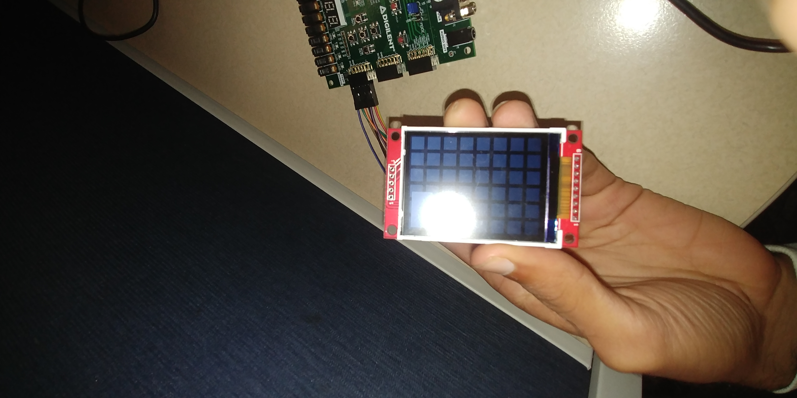
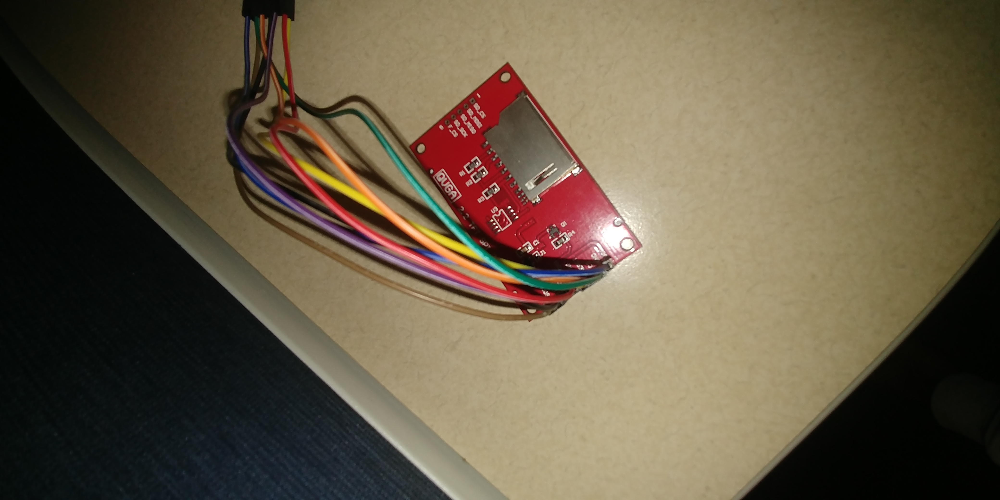

# Lab 2B: QP-Nano, LCDs, and Encoders

*Varun Iyer and Rajan Saini, 2019-11-11*

## Purpose

​	The primary output peripheral for this lab is the LCD. The input peripherals are the rotary encoder and the buttons on board the FPGA. The design requirements are as follows:

​	The LCD must display a unique background composed primarily of 30$\times$30 squares with 10-pixel gaps. If the device’s inputs are ‘active’ (have been pressed/twisted in the last two seconds), the device must display an overlay on top of the background. The overlay consists of a volume bar and text sprites. If the encoder is twisted to the right, the volume displayed increases, and if it is twisted to the left, the volume decreases. The buttons on the FPGA correspond to different messages displayed above the volume bar. If no inputs have been touched in two seconds, the overlay disappears and leaves only the background behind.

## Methodology

### State Machine

We will use QP-Nano to create a state machine fulfilling these design requirements.

We will encode this machine into QP-Nano with two primary states, `Active` and `Inactive`. The encoder will be an ad-hoc state machine primarily interacting with the encoder interrupt handler. The relevant state variables we will use are a countdown timer to determine when the state should transition to `Inactive` and an integer representing the current volume.

We will define 9 signals: one for each encoder twist, one for the encoder push, one for a clock tick, and five for each button on the FPGA.

### Inputs

We will debounce the encoder using an ad-hoc state machine similar to the one used in Lab 2A, only sending a SIG to QP-Nano on the completion of a rotation. The button presses will be debugged using a short countdown timer. As the machine's response is identical regardless of the current state, so these signals will be handled at the top level state.

We detect inactivity be beginning (or refreshing) a countdown timer on every input and transitioning to the inactive state when the timer reaches a specified value.

### LCD

We have created drawing functions which only write to the specific areas of the screen which need to be redrawn. We do this without using a frame buffer; each drawing function has knowledge of the area to which it draws to and clears the area itself by regenerating the background pattern at that area.

The background pattern was a simple function, initially painting the specified area gray and then redrawing squares on top of this. We created a `drw_clr` function which would generate and paint a specific area of the background, allowing us to clear the screen only as needed.

Our LCD was purchased from HiLetgo on Amazon, and we did not have any problems with acquisition or setup.

## Results

We ran into difficulties with the rate of the SPI screen write and had to re-optimize our drawing functions several times to get them to work on time. We faced some difficulties with our encoder, which David described as cheaper and less tactile than the Digilent models. However, our project was ultimately able to function according to the design specifications.